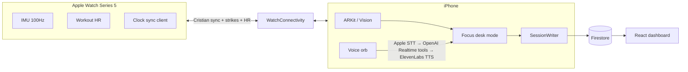

# Synapse — Master Agent Guide

**Canonical source of truth.** Agents and humans start here. Other docs are stubs or schema detail that point back to this file.

Visual companion (not a duplicate of this doc): Cursor canvas `synapse-master-overview.canvas.tsx`. Deeper inventory / forks: `synapse-pivot-strategy.canvas.tsx`.

---

## 1. What Synapse is

**Synapse Focus** is a consumer **health-aware Pomodoro / deep-work companion** for builders, students, and knowledge workers.

- **Lead story:** the timer that knows when *your* brain is done — catch fade mid-block, coach the break, lock back in for another ~10.
- **Tech moat (second sentence):** fused **phone camera** (vision / arousal proxies) + **Watch IMU** (stillness / fidget @ 100Hz) + **Watch HR** (trend vs session baseline), time-aligned with Cristian clock sync.

Not a hospital platform, not diagnosis, not a car OEM SDK. Clinic / rehab / data-platform angles are PDF / Q&A upside only — never the video cold open.

**One-line pitch:** *Pomodoro that knows when YOUR brain is done — phone + Watch fuse vision, stillness, and HR; when you drift, voice says take a break.*

---

## 2. Who / problem / sell / viral

| Lens | Answer |
| --- | --- |
| **Whose problem?** | Builders, students, knowledge workers who push past fade and only notice when the day is shot. Fixed Pomodoro ignores the body; cognitive fatigue is a health problem disguised as productivity. |
| **How do you sell it?** | “Pomodoro that knows when YOUR brain is done.” Consumer wellness companion — not diagnosis. The timer adapts to you. |
| **How does it go viral?** | Shareable break moments + sticky voice: “Synapse caught me fading.” Hallway demos, before/after focus checks, hackathon clips. Voice orb is the clip magnet. |

---

## 3. Architecture overview



### Layers

| Layer | Role |
| --- | --- |
| **Watch** | Workout keep-alive, `CMMotionManager` @ 100Hz, strike gate, discrete HR, WatchConnectivity only (no Firebase). UI = status + haptics. |
| **Phone** | Sole Firebase writer. Focus HUD, face/arousal path, trial engines (Vision PVT / Kinetic lab), SessionWriter, floating voice orb. |
| **Firestore** | Live sessions + trials / Focus epochs. Project: `synapse-clinical-hz`. Schema: [SCHEMA.md](SCHEMA.md). |
| **Web** | Clinical / judge HUD (Vite + React). Separate ownership — do not build unless asked. |

### Voice pipeline

**Apple Speech (on-device STT) → OpenAI Realtime (text + function tools) → ElevenLabs TTS.**

Orb commands (tools shipped): start focus · how’s my load · take a break · guide a breath · another 10 · end session.

### Focus desk mode sensors (today)

Silent sensing during a Focus block: vision/arousal proxies + motion stillness/fidget + HR vs baseline → fade score → sharp / fading / break now. Camera mode UX (always-on vs brief check-ins) and attention classifiers are **designed, not all shipped** — see §6.

### Modules (Firestore `module` field)

| Module | Purpose |
| --- | --- |
| `focusDesk` | Consumer Focus — health-aware Pomodoro. Primary demo. |
| `visionPvt` | Lab: single-flash PVT (saccade / arousal). No Watch required. |
| `kineticClock` | Lab: 8-direction clock; Watch strike + octant. |

Full field definitions: [SCHEMA.md](SCHEMA.md).

---

## 4. What’s shipped vs not

### Shipped / demo-ready

- **Focus loop:** Hub → Focus → setup / live / break / recap
- **Fade signal:** HR + arousal + motion energy → sharp / fading / break now
- **Break:** countdown + optional breath reset (box / 4-7-8) + lock-in ~10
- **Pattern tips:** Recap / Hub heuristics from session history
- **Voice tools** for focus / breathing (needs API keys for full TTS/STT path)
- **Sensing stack:** TrueDepth face path, Watch 100Hz motion, workout HR → phone + Firestore, Cristian clock sync
- **Lab modules:** Vision PVT + Kinetic Clock (hub lab paths)
- **Web dashboard:** live Firestore + Demo mode + QR
- Build + Focus unit tests passed

### Not shipped yet (design locked where noted)

- Camera **Option A** always-on / **Option B** brief check-ins settings UX
- **HR spike → camera wake** (esp. brief mode)
- On-device locked-in / distracted attention classifiers beyond current fade proxies
- Soft-timer + early break CTA **hybrid weights** (numbers not locked)
- Face-frame upload guardrails as explicit product surface (principle locked: no face video to cloud)
- Cross-session personal trends UI / athlete picker (baseline is in-session today)
- Continuous multimodal “packets” stream; `cognitiveMotorGapMs` stays nil
- Stretch: share card, streak, Vercel recap page, ambient break music, leaderboard
- Supabase consumer accounts (candidate only — Firebase today)

---

## 5. Build plan (weekend priorities)

**Hard deadline context:** Sunday 12:00 GMT (Juno). Prefer ship evidence + MP4 over new platforms.

### P0 — high value (do / finish first)

| Item | Why |
| --- | --- |
| API keys for voice demo | Orb tools exist; without keys no spoken coach |
| ≤60s MP4 from Focus loop | Submission artifact |
| “Caught fading” user evidence | Bonus users / viral proof |
| Pitch hardware + fail-safes | Day-of reliability |

### P1 — high value if time

| Item | Why |
| --- | --- |
| Soft timer + early break CTA polish | Matches locked over-nudge story |
| Camera mode A/B + HR wake (minimal) | Makes sensing design real in demo |
| Name → athleteId | Evidence / hallway demos |
| 1–2 page PDF (Focus thesis; clinic = Q&A) | Judges who dig |

### P2 — low value / defer

| Item | Why defer |
| --- | --- |
| Replace Firebase with Supabase | Mid-stream rewrite; candidate later |
| Continuous 10Hz packet pipeline | Not needed for Focus demo |
| cognitiveMotorGap fusion trial | Dual modules + break-point already enough |
| Clinic / OEM apps | Never lead; PDF only |
| Diagnostic claims | Out of scope / unsafe |
| Ambient music, leaderboard, Vercel recap | Stretch polish only |

---

## 6. Focus sensing design (locked, not all built)

Consumer lead stays: catch fade → coach break → lock back in. Camera + attention is the moat under that story.

### Camera mode (settings / setup — user picks one)

| Mode | Behavior |
| --- | --- |
| **A — Always on** | Camera active whole focus block. Best signal continuity; higher battery / privacy surface. |
| **B — Brief check-ins** | Camera wakes on interval for a short look, then sleeps. Lighter everyday default. |

**HR spike wake:** In brief mode, a Watch HR jump still opens a short camera window. Always-on already has continuous vision; spike remains a fusion cue for urgency.

### Attention model (honest)

| Locked in (proxies) | Distracted (proxies) |
| --- | --- |
| Face present, oriented toward phone, stable head pose, lower fidget | Looking away, leave frame / face lost, restless motion |

**Not** multi-monitor gaze or full eye-tracking. TrueDepth is phone-facing only.

### Break nudges

- Recommend breaks when distraction / fade is rising — not only a fixed clock.
- **Over-nudge bias:** catch early; prefer more sensitive than late.
- **Default hybrid:** soft timer remains as fallback; voice / break CTA can fire early when distraction rises.
- Exact hybrid weights **not locked to numbers** yet — keep soft timer floor + early CTA on rising fade.

### Privacy

- **On-device:** sensing + classification (ARKit / Vision + local heuristics). **Do not stream face video to the cloud.**
- **Cloud OK:** voice coach (OpenAI / ElevenLabs) + optional insight text only.

---

## 7. Demo script (60s MP4)

Fusion is visible in the HUD — never the cold open.

| Time | Screen / shot | Beat | Say (approx.) |
| --- | --- | --- | --- |
| 0–7s | Focus start: 15/25/45/smart picker | Hook | “Every Pomodoro uses the same clock. Your brain doesn’t. Synapse Focus watches when YOU’RE done.” |
| 7–20s | Live HUD: time + sharp + HR; Watch paired | Sensors → HUD | “Phone and Watch silently read load — eyes, stillness, heart rate vs your baseline — and show sharp or fading live.” |
| 20–32s | HUD → fading → break now | Drift | “You’re still in the block… but the signal says you’re fading.” |
| 32–44s | Voice catch + Watch haptic; break; optional breath | Proof / viral | “Take a break.” Offer breath: “Guide me through a breath.” ElevenLabs walks box / 4-7-8. |
| 44–60s | “Ready for another 10?” → next block or recap + GitHub | Sell + close | “Ready for another 10?” — “Pomodoro that knows when YOUR brain is done. Share the catch.” |

**Pacing:** Hook → live HUD → fade → voice break → optional breath → lock-in 10 / recap. If you open on “data fusion platform,” judges miss the product.

---

## 8. Sponsor usage (honest)

| Sponsor | Meaningful use | Status |
| --- | --- | --- |
| **OpenAI** | Realtime voice agent: navigate app, start/end focus, status, tools. Spoken audio is ElevenLabs — Realtime is brain + tools. | Shipped · needs API key |
| **ElevenLabs** | Spoken coach + guided breathing on break → lock-in ~10 | Shipped · needs API key |
| **Anthropic / Claude** | Build-time AI (Cursor) — tooling, not in-app inference | Build tooling |
| **Firebase** | Live sessions + history this weekend (phone → Firestore) | In product |
| **Supabase** | Candidate later for consumer accounts / longer pattern store | **Not shipping** |
| **Vercel** | Stretch: shareable focus recap / landing if time. Clinical HUD is Firebase Hosting today | Stretch host |
| **Healf / Juno / Encode** | Event / wellness partners — not in-product SDKs | Event partners |

**Talking point:** Lead with OpenAI Realtime + ElevenLabs. Do **not** claim Supabase production use.

Live Hosting (judges): https://synapse-clinical-hz.web.app · QR: https://synapse-clinical-hz.web.app/qr

---

## 9. Agent rules (never violate)

1. **Read this file first** (`docs/MASTER.md`) before changing product direction or architecture.
2. **XcodeGen:** edit `project.yml`, then `xcodegen generate`. Never hand-edit `.pbxproj`. Never use Ruby/`xcodeproj` gem.
3. **Stack:** iOS 17+, watchOS 10.0, SwiftUI, `@Observable`.
4. **Bundle IDs (locked):** `com.synapse.app` / `com.synapse.app.watchkitapp`.
5. **Phone is the only Firebase writer;** watch uses WatchConnectivity only.
6. **Series 5:** `CMMotionManager` @ 100Hz — no `CMBatchedSensorManager`. Watch UI stays trivial (status + haptics).
7. **Do not own/build `web/`** unless explicitly asked. Web agent owns `web/**`, `firebase.json`, `firestore.rules`, `.firebaserc`.
8. **Coordinator vs implementer:** parent/coordinator chat plans and delegates; implementers write code. Don’t reinvent strategy in a leaf thread — update MASTER if product truth changes.
9. **NEVER commit secrets:** real `GoogleService-Info.plist`, `OPENAI_API_KEY`, `ELEVENLABS_API_KEY`, filled Info.plist / VoiceSecrets. Use `.example` stubs and scheme env.
10. **Wellness signal only** — no diagnostic / disease-detection claims.
11. Prefer protocols + mocks for testability; run tests after logic changes.

Ownership sketch: native = `project.yml`, `Sources/**`; web = `web/**` + root Firebase config; schema contract shared via [SCHEMA.md](SCHEMA.md).

---

## 10. How to run / keys

```bash
cd /Users/amirdzakwan/Documents/Synapse

# 1. Generate Xcode project
xcodegen generate
open Synapse.xcodeproj

# 2. Signing (once per machine)
#    Xcode → Synapse / SynapseWatch → Signing & Capabilities → Team

# 3. Firebase plist (gitignored — never commit the real file)
#    Project: synapse-clinical-hz · iOS: com.synapse.app
firebase apps:sdkconfig IOS 1:325784899993:ios:b6115b338638970d050308 \
  --project synapse-clinical-hz \
  -o Sources/iOS/GoogleService-Info.plist
# Fallback build-only:
#   cp Sources/iOS/GoogleService-Info.plist.example Sources/iOS/GoogleService-Info.plist

# 4. Voice keys (preferred: Xcode scheme → Run → Arguments → Environment Variables)
#    OPENAI_API_KEY
#    ELEVENLABS_API_KEY
#    optional ELEVENLABS_VOICE_ID
# Also: Info.plist placeholders (local only) or VoiceSecrets.plist.example pattern.
# Without keys the orb still appears; talk/proactive TTS errors until configured.

# 5. Simulator build smoke
xcodebuild build -scheme Synapse \
  -destination 'platform=iOS Simulator,name=iPhone 16' \
  -quiet

# 6. Web dashboard (separate ownership)
cd web && npm install && npm run dev   # http://localhost:5173
# Seed: node scripts/seedDemoRest.mjs  (see web/README.md)
```

Face tracking + WatchConnectivity need **physical devices** for a real demo. Series 5 caps at watchOS 10.6.

---

## 11. File map

```
project.yml                 # XcodeGen — edit here, then generate
AGENTS.md                   # Stub → points here; critical never-violate bullets only
README.md                   # Getting started → points here
docs/MASTER.md              # ← YOU ARE HERE (canonical)
docs/SCHEMA.md              # Frozen Firestore contract (full fields)
docs/PITCH_CHECKLIST.md     # Stub → pitch day-of condensed in §12
docs/PHYSICAL_RANGE_CHECKLIST.md  # Stub → condensed in §12
docs/COORDINATION.md        # Stub → ownership in §9
docs/archive/               # Historical plans (out of date; see archive README)

Sources/Shared/             # ClockDomain, StrikeEvent, WC keys (both targets)
Sources/iOS/
  Face/                     # TrueDepth / ARKit path
  Session/                  # FocusEngine, fade, breath, PVT, Kinetic, SessionWriter path
  UI/                       # ContentView, FocusViews, AR preview
  Voice/                    # STT → Realtime → ElevenLabs + orb
  Firebase/ Connectivity/ Replay/
  GoogleService-Info.plist(.example)
Sources/watchOS/            # MotionMonitor, WorkoutKeepAlive, sync, haptics

web/                        # Clinical dashboard (do not own unless asked)
  src/types/session.ts      # Keep in sync with SCHEMA.md
firebase.json · firestore.rules · .firebaserc
```

Canvases (visual only):  
`~/.cursor/projects/Users-amirdzakwan-Documents-Synapse/canvases/synapse-master-overview.canvas.tsx`  
`~/.cursor/projects/Users-amirdzakwan-Documents-Synapse/canvases/synapse-pivot-strategy.canvas.tsx`

---

## 12. Checklists

### Physical range (TrueDepth + jab distance)

TrueDepth degrades past ~**70 cm**; jabs extend ~60–70 cm. Validate on a **physical Face ID iPhone** before trusting the trial engine.

1. Tripod, portrait, **60–70 cm** camera → face (tape measure).
2. HUD **Tracked** (green); distance ≈ measured cm.
3. Setup: wireframe mesh stuck to face; cyan gaze ray moves on **eye glance** L/R (not only head turn); Calibrate → gaze near cell 4 (confidence only).
4. **10 stop-short jabs** — face stays Tracked; if lost → athlete closer, punch **past** phone.
5. Tripod vibration: 5 near-misses must not reset AR anchor.
6. Lock ergonomics (punch at vs past) early — not in hour 40.

**Pitch note:** Timing uses saccade **onset** after flash (60 Hz), not lab screen-gaze pixel accuracy.

### Pitch day-of

**Hardware**

- [ ] Series 5 at **100%** + charger on table (workout drains fast)
- [ ] iPhone Face ID on tripod at **60–70 cm**
- [ ] Personal hotspot ready; Watch + phone paired; test punch / Focus pair
- [ ] Backup demo video on laptop

**Projection / QR**

- [ ] Dashboard full-screen: https://synapse-clinical-hz.web.app
- [ ] QR: https://synapse-clinical-hz.web.app/qr on title slide
- [ ] AirPlay iPhone in a corner if showing lab targets; disable auto-lock
- [ ] Prefer Hosting URL over localhost / tunnel

**Fail-safes**

- [ ] Dashboard **Demo mode** if net dies
- [ ] Pre-seed `sessions/demo-session-001`
- [ ] Rules open for demo window (expire comment in `firestore.rules`: 2026-08-01)
- [ ] Voice keys set in scheme for Focus MP4 path

**Freeze:** late hours = pitch only; new code is a bug unless fixing a demo blocker.

---

*When product or ship status changes, update this file first, then stubs/canvases.*
