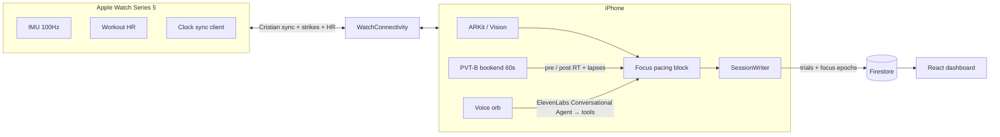

# Synapse — Master Agent Guide

**Canonical source of truth.** Agents and humans start here. Other docs are stubs or schema detail that point back to this file.

Visual companion (not a duplicate of this doc): Cursor canvas `synapse-master-overview.canvas.tsx`. Deeper inventory / forks: `synapse-pivot-strategy.canvas.tsx`.

**Pitching this weekend?** Read **§1** (positioning), **§7** (demo script), **§13 Q&A survival kit** (banned phrases, the scripted answers, and the **decision point** on what we claim to measure — read them aloud), and **§14** (why we repositioned). **§12 has one blocking pre-pitch measurement that selects which answer you give.** Section numbers §1–§12 are unchanged from the pre-repositioning doc — nothing renumbered, two sections appended.

---

## 1. What Synapse is

**Synapse** is **cognitive pacing, PVT-anchored**: an iPhone + Apple Watch app that learns your own physiological baseline at the start of a work block and tells you to stop *before* you overrun your limit — not after.

**Opening line. Say this first, every time:**

> *“It looks like a Pomodoro timer. It’s actually a pacing tool — for people whose fatigue isn’t a productivity problem, it’s a medical one.”*

- **Primary user:** people with **energy-limiting conditions** — long COVID / ME-CFS, where **pacing is NICE-recommended standard of care** — and **post-concussion return-to-work**.
- **Secondary user:** knowledge workers on the burnout track. Same mechanism, lower stakes.
- **What it actually does:** learns your baseline in the opening minutes of a block, watches cheap physiological proxies against *that* baseline, and nudges a break when the drift holds. A 60-second **PVT-B** — the published brief psychomotor vigilance test (Basner, Mollicone & Dinges, 2011) — bookends the block, so the recap shows a measured reaction-time change instead of a vibe.
- **Tech moat — the second sentence, never the first:** **Watch HR** (trend vs session baseline) leading, with **Watch IMU** (stillness / fidget @ 100Hz) and the **phone camera** (presence / attention + face arousal when the channel is live), time-aligned with Cristian clock sync. **Pitch claim locked to §13 Answer A (three proxies)** — presenter decision 26 July. Keep the §12 diagnostic env on in Debug so you can re-check if a judge asks how you know.

Not a hospital platform, not diagnosis, not a car OEM SDK. Clinic / rehab / data-platform angles are PDF / Q&A upside only — never the cold open.

**One-line pitch:** *Cognitive pacing for people who can’t feel their limit until they’ve already crossed it — phone + Watch read your physiology against your own baseline, a 60-second PVT keeps the signal honest, and the voice coach calls the break.*

### Why this framing (and not “health-aware Pomodoro”)

| Claim | Why it holds |
| --- | --- |
| **Unambiguously healthcare** | Pacing for post-viral fatigue and concussion recovery is a clinical concept, at a consumer healthcare event. “Productivity timer” is the wrong category and a crowded one — Forest, Opal, Rize, and Apple’s own Focus modes are already there. |
| **The intervention is evidence-based even though the sensing is a proxy** | We are not claiming a validated sensor. We are claiming a validated *intervention* — pacing — with a cheap delivery mechanism. That distinction is the whole pitch, and it survives scrutiny. |
| **“Your own baseline” is the protocol, not a shortcut** | Pacing protocols are explicitly individual: your envelope, not a population norm. In-session baselining is what the clinical concept requires anyway. |
| **It makes the sensing necessary, not decorative** | Pitched as a Pomodoro, a judge can say *“just use a timer”* — and be right. Pitched at people who genuinely cannot self-assess their limit until they’ve already crashed, the sensing is the only possible solution. |

### Market context

**Visible** does HR-based pacing for long COVID and validates that this market exists and pays — but it requires a dedicated armband. Our wedge is two things: **no extra hardware** (a phone and a Watch people already own), and **in-the-moment intervention** rather than after-the-fact logging. Visible tells you yesterday was too much; we interrupt today.

---

## 2. Who / problem / sell / viral

| Lens | Answer |
| --- | --- |
| **Whose problem?** | People with energy-limiting conditions who must pace to function — long COVID / ME-CFS, post-concussion return-to-work — and who cannot reliably feel the limit until they have already crossed it and lost the next day (or week) to it. Knowledge workers on the burnout track are the same failure mode with a slower fuse. |
| **What’s broken today?** | Pacing is standard of care and is currently delivered as *advice*: “learn your envelope, rest before you crash.” The instrumented option (Visible) works but needs a dedicated armband and mostly reports after the fact. A fixed 25-minute clock knows nothing about you at all. |
| **How do you sell it?** | The opening line in §1, then the demo: measure, work, measure. Consumer pacing companion — a wellness signal and a nudge, **never** a diagnosis. |
| **How does it go viral?** | The post-block PVT screen: *“280 ms → 340 ms, two lapses.”* A number you didn’t know about yourself, thirty seconds after you felt fine, is more shareable than a streak. Plus the voice catch — “Synapse called it before I did.” |

**Two questions this framing exists to answer** (full scripts in §13):

1. *“Why can’t I just take a break when I feel tired?”* — Because for the primary user, that signal is the thing that’s broken. Post-exertional malaise arrives hours late; by the time it feels wrong, the cost is already booked.
2. *“How do you know it’s right?”* — We don’t claim to know. We ship the PVT, we tuned deliberately toward over-nudging, and we say out loud what the signal can’t separate yet.

---

## 3. Architecture overview



### Layers

| Layer | Role |
| --- | --- |
| **Watch** | Workout keep-alive, `CMMotionManager` @ 100Hz, strike gate, discrete HR, WatchConnectivity only (no Firebase). UI = status + haptics. |
| **Phone** | Sole Firebase writer. Focus HUD, PVT bookend, face/arousal path, lab trial engines (Vision PVT / Kinetic), SessionWriter, floating voice orb. |
| **Firestore** | Live sessions + trials / Focus epochs. Project: `synapse-clinical-hz`. Schema: [SCHEMA.md](SCHEMA.md). |
| **Web** | Judge-facing HUD (Vite + React). Separate ownership — do not build unless asked. Reads trials **and** `sessions/{id}/epochs`, so a live Focus block renders as a timeline (fade score, HR, phase, fade events). Offline fail-safe routes: **`/demo/focus`** · `/demo/vision` · `/demo/kinetic` — canned snapshots, no network. Live seeded session: **`demo-focus-001`** (`node scripts/seedDemoRest.mjs`). Unknown modules now **fail loudly** as “Unsupported module” instead of silently rendering as Vision. It deliberately does **not** render PVT fields — that is a call, not a bug: the reaction check is a phone-screen moment. |

### Voice pipeline

**ElevenLabs Conversational Agents** (official Swift SDK / LiveKit) — one Synapse Coach agent with modes `coach` / `breath` / `reflect`. Mic audio and TTS are in-band; client tools drive `AppModel` (Focus, breath phases, check-in). Setup: [ELEVENLABS_AGENT.md](ELEVENLABS_AGENT.md). Requires `ELEVENLABS_AGENT_ID` (public agent for demo).

Orb commands (tools): start/end focus · status · break · guided breath · lock-in 10 · reaction check · optional post-recap talk-through (`submit_check_in`).

Proactive lines (setup tip, countdown, fade nudge, break start, session complete) are short agent utterances, not a separate TTS stack.

### Focus block sensing (today)

Silent sensing during a block: vision/arousal proxies + motion stillness/fidget + HR vs session baseline → composite fade score → **three-state HUD**.

| State | On screen | Meaning | What the user should do |
| --- | --- | --- | --- |
| Calibrating | **“Learning your baseline · N%”** with a dashed ring | Pre-roll while the baseline window fills. Holds just short of 100% if HR is still settling. | Nothing — work normally. This *is* the calibration. |
| Steady | **“Steady”** | Composite score sitting inside your baseline band. | Keep working. |
| Fading | **“Easing off”** · *“Drifting from your baseline”* | Score rising toward threshold — proxies starting to move together, but not yet a call. | Warning shot. Finish the thought; a break is coming. |
| Break | **“Break suggested”** · *“Your body is asking for a pause”* | Score crossed baseline + 2σ (cooldown-gated, multi-fire). | Stop. Take it, extend once, or dismiss. |

Escalation is by warmth — teal → sand → amber, no reds, no motion spikes. The dashed calibrating ring is a **pitch asset, not just chrome**: it is the visible answer to “what is it doing for the first two minutes?” — it is learning you, and it says so.

**Say the middle state as “easing off,” not “fading.”** The three-state HUD landed on 25 July (it was binary plus a score ring before that). Strings above were read off `FocusSignalState` in `Sources/iOS/UI/FocusViews.swift` at 18:30 BST — **re-confirm at the freeze** and say whatever the screen says. Never describe a state the HUD does not render.

Scoring internals (`FocusFadeDetector`): weighted composite — HR drift above the session anchor 0.45, arousal 0.40, wrist motion energy 0.15 — sampled every 8 s, compared against a rolling baseline at **mean + 2σ**, with a 90 s cooldown between fires. A channel that is missing, or that carried no usable signal during calibration, drops out and the remaining weights renormalise, so the composite stays on one comparable 0…1 scale. A fade needs the threshold to be exceeded on **two consecutive samples**, which adds **~16 s** before it can fire — rehearse for that on short blocks (§12).

**Signal-quality caveat (read before claiming fusion).** An audit simulating the pre-fix detector found the arousal channel very likely **inert**: the term was the absolute `1 − eyeWide`, and ARKit’s `eyeWide` rests near 0 on a neutral face, so it sat pinned near **0.97** — the maximum-fade end — where it could only move *downward*. Roughly 98% of the baseline composite was that constant offset; a realistic eyelid droop was worth about **0.53 bpm** against a **+4.45 bpm** trigger (~12% of what was needed), while a single wide-eyed moment moved the score **more than the entire trigger**, letting the face channel cancel a genuine fade on its own. Separately, `hrAnchor` was the first sample, never revised and clamped at 0 below itself, so someone who sat down warm at 98 bpm and settled to 72 would have needed 102 bpm to ever fire.

**The code fixes have since landed** — arousal is now z-scored against its own in-session distribution with a **noise-floor guard that drops the channel entirely when baseline σ is below 0.010**, the HR anchor is median-derived and tracks downward, calibration defers while HR is still settling, and a **2-sample debounce** requires the threshold to hold across consecutive samples. **Pitch decision (26 July): §13 Answer A** — say three proxies. Debug scheme keeps `SYNAPSE_AROUSAL_DIAG=1` so the console verdict can be re-read if needed; Answer B remains the scripted fallback if a live check ever flips.

Camera mode UX (always-on vs brief check-ins) and attention classifiers are **designed, not all shipped** — see §6.

### PVT-B bookend (“Reaction check”)

A tap-response psychomotor vigilance task run immediately before and after a focus block: a stimulus appears after a random interval, you tap, we record reaction time. Pre-block gives the reference; post-block gives the delta the recap is built around. **This is the strongest sentence in the pitch — say the protocol name.**

**We implement PVT-B**, the brief psychomotor vigilance test from **Basner, Mollicone & Dinges, *Validity and sensitivity of a brief psychomotor vigilance test (PVT-B) to total and partial sleep deprivation*, Acta Astronautica 69 (2011) 949–959.** It is a *named, published, validated instrument* designed for exactly our situation — settings where the 10-minute PVT is impractical — not a shortened improvisation. Against the 10-minute standard it changes three things, all implemented in `TapPVTEngine` / `TapPVTResult`:

| Parameter | 10-min PVT | PVT-B (what we ship) |
| --- | --- | --- |
| Inter-stimulus interval | 2–10 s | **1–4 s**, measured from the previous response, inclusive of the RT feedback dwell |
| Lapse | RT ≥ 500 ms | **RT ≥ 355 ms** |
| Valid response | RT ≥ 100 ms | RT ≥ 100 ms — faster is an anticipation, scored as a false start |

**Why 355 ms is the correct number, not a liberal one.** The brief protocol produces systematically faster reaction times, so Basner et al. lowered the cutoff specifically to restore lapse frequency to what the 10-minute test reports at 500 ms. Keeping 500 ms on a short test would **undercount** lapses. The authors report the trade honestly: roughly a **23% loss of sensitivity for a 70% cut in duration**. Firestore records `lapseThresholdMs` on every run, so stored data stays self-describing if the protocol ever changes ([SCHEMA.md](SCHEMA.md)).

**The anticipation rule earns its own sentence.** Responses under 100 ms are false starts, not fast reactions — a finger already in motion. Without that floor, early taps score as legitimate reactions, drag the **pre**-block median *down*, and therefore **inflate** the apparent post-block slowdown. Implementing it means our delta isn’t flattered by jumpy fingers, which is the answer to anyone probing whether the number is real. False starts are counted and reported separately: a jumpy finger is a different failure from a lapsing one.

**Current parameters:** 60 s run · 1–4 s ISI · ~20 trials · 355 ms lapse · 100 ms anticipation floor · 3 s no-response window · median RT as the headline · a pre/post comparison returns nothing unless **both** sides have ≥3 valid trials.

**Two honest deviations from the validated protocol** (both labelled in code, both worth volunteering):

- **60 s rather than the validated 3 min.** Fewer trials means a noisier median — which is precisely why the recap frames a **within-person pre/post delta minutes apart** rather than a score against population norms. That framing is a deliberate consequence of the deviation, not a hedge, and the presenter should say so in that order.
- **3 s no-response window rather than 30 s.** A 30 s stall would eat half a 60 s test, and real lapses land far inside 3 s.

Distinct from the `visionPvt` **lab** module, which measures *saccade onset* to a **peripheral** flash on a 3×3 field via TrueDepth (center is fixation only) and needs a tripod. The bookend is a finger tap on the phone in your hand: same construct, no rig, demo-safe.

**Status: shipped and wired.** Opt-in **“Reaction check”** card at Focus setup (**off by default** — see §12), then pre-test → block → post-test → recap, with the delta card leading the recap. The dashboard deliberately does **not** render PVT fields; the reaction story is a phone story.

### Modules (Firestore `module` field)

| Module | Purpose |
| --- | --- |
| `focusDesk` | Consumer pacing block + PVT bookend. Primary demo. |
| `visionPvt` | Lab: peripheral single-flash on 3×3 (center fixation; outer cells flash); saccade / arousal. No Watch required. |
| `kineticClock` | Lab: 8-direction clock; Watch strike + octant. |
| `postureCheck` | Lab only (local): sit-tall baseline + front-camera upper-body drift. Not a Firestore writer in v1. |

Full field definitions: [SCHEMA.md](SCHEMA.md).

---

## 4. What’s shipped vs not

### Shipped / demo-ready

- **Focus loop:** Hub → Focus → setup / live / break / recap
- **Fade signal:** HR + arousal + motion energy → composite score vs in-session baseline (mean + 2σ, 90 s cooldown, multi-fire). **Pitch: three proxies (§13 Answer A).** Face channel still self-disables if baseline σ is below the noise floor.
- **Break:** countdown + optional breath reset (box / 4-7-8) + lock-in ~10
- **Pattern tips:** Recap / Hub heuristics from session history
- **Voice tools** for focus / breathing / optional reflect check-in (needs `ELEVENLABS_AGENT_ID`)
- **Sensing stack:** TrueDepth face path, Watch 100Hz motion, workout HR → phone + Firestore, Cristian clock sync
- **Lab modules:** Vision PVT + Kinetic Clock + **Posture Check** (hub lab paths)
- **Posture Check:** Front-camera upper-body proxy (Vision body pose + face distance) vs sit-tall baseline. Lab ~10 s (80 samples); Focus ~28 s (220 samples) with a sit-tall voice prompt while collecting. Soft Focus HUD flash + Clawd nudge when drift holds (~0.48 score, ~7–8 s sustain, 90–120 s cooldown) — **does not** weight the fade / break score. Off in Watch-only. Not part of §13 Answer A pitch claim.
- **HUD:** calibrating pre-roll → Steady · Easing off · Break suggested
- **Presets:** Classic 25/5 · Short 15/5 · Deep 50/10 · **Quick 5/1** (4-sample baseline, ~32 s) · 2/1 stage block behind a Settings toggle
- **PVT-B bookend:** opt-in “Reaction check” at Focus setup → pre-test · block · post-test · recap led by the delta card
- **Watch-only Focus:** camera fully off; fade from Watch HR + stillness; honesty copy in setup / live HUD; voice `set_camera_mode`
- **Camera modes (MASTER §6):** Always on · Brief check-ins (interval ~90–120s, wake ~12s, HR spike wake +8 bpm) · Watch only. Live chip: Camera on / Checking in / Camera off. Face stays on-device.
- **Web dashboard:** live Firestore + `focusDesk` epoch timeline + `/demo/*` offline routes + QR
- Build + Focus unit tests passed

### Landed 25 July — all four surfacing items are in

The repositioning implied four pieces of work. **All four have shipped.** What remains is confirming them on your hardware, in the room (§12) — a shipped feature you haven’t seen run is still a beat you can lose.

| Item | Owner | State |
| --- | --- | --- |
| **Three-state HUD** | Native | Shipped as **“Steady” → “Easing off” → “Break suggested”**, plus a **“Learning your baseline · N%”** dashed-ring pre-roll. Say “easing off”, never “fading”. |
| **Preset naming** | Native | Shipped: **Quick 5/1** is the pitchable short-baseline option; the compressed **2/1 stage block is behind Settings → “Show 2 / 1 stage block”**, off by default. |
| **PVT-B bookend** | Native | Shipped end to end: opt-in card at setup, pre → block → post, recap leads with the delta card. **The toggle is off by default — turn it on before you present.** |
| **Dashboard Focus support** | Web | Shipped: `FocusTimeline` renders fade score, HR and fade events; `/demo/focus` is the offline fail-safe; unknown modules fail loudly. |

Also moved: the old **Canned Replay** button now lives in **Settings → “Demo & judging” → “Seed dashboard demo session”**.

### Not shipped yet (design locked where noted)

- On-device locked-in / distracted attention classifiers beyond current fade proxies
- **HRV** — the signal that would separate “stressed” from “fading”; named openly as the honest gap (§13) and the next thing we would add
- **PERCLOS eyelid channel** — the honest fatigue input that would replace `eyeWide`; the arousal diagnostic already prints PERCLOS-70. Deferred, §14
- **PVT fields on the dashboard** — deliberately absent, not a gap: the reaction check is a phone-screen moment
- Soft-timer + early break CTA **hybrid weights** (numbers not locked)
- Face-frame upload guardrails as explicit product surface (principle locked: no face video to cloud — already true for sensing)
- Cross-session personal trends UI / athlete picker (baseline is in-session today)
- Continuous multimodal “packets” stream; `cognitiveMotorGapMs` stays nil
- Stretch: share card, streak, Vercel recap page, ambient break music, leaderboard
- Supabase consumer accounts (candidate only — Firebase today)

---

## 5. Build plan (weekend priorities)

**Hard deadline context:** submissions **Sunday 12:00 BST**. Judged on **Product / Demo / Presentation / Code quality**. Prefer ship evidence + MP4 over new platforms.

### P0 — high value (do / finish first)

| Item | Why |
| --- | --- |
| **Arousal diagnostic run (~3 min, blocking)** | Selects which “what do you measure” answer the presenter gives. Nothing about the pitch is final until this is read — steps in §12 |
| **Venue evidence — 90 minutes walking the room** | **Highest-leverage item on this list.** See below. |
| Rehearse one full run with the Reaction check toggle **on** | It’s off by default, and it gates the delta card — the demo’s payoff |
| Screen copy confirmed against code (§12) | You must say what the screen says: “Easing off”, 355 ms, not 500 |
| API keys for voice demo | Orb tools exist; without `ELEVENLABS_AGENT_ID` no spoken coach |
| ≤60s MP4 from the pacing loop | Submission artifact + fail-safe if the live demo dies |
| Live-demo pre-flight (§12) | Day-of reliability; the demo is a scored category |
| Read §13 aloud, twice, before pitching | Q&A is where this pitch is won or lost |

**Venue evidence (do this, don’t skip it):** spend **90 minutes walking the room**. Get **10–12 people** to run one short block on the phone. Ask exactly one question afterwards: **“Did that match how you felt?”** Tally the answers. A slide reading **“n=11, 9 said the nudge matched”** beats every claim in the deck — it is the only primary evidence anyone at this event will have, it directly answers “how do you know it’s right,” and it costs you nothing but floor time.

- **Suggested window:** Saturday **19:00–20:30**, when the room is fullest and people are between pushes.
- **Fallback:** Sunday **08:30–10:00**, finishing before the code freeze so the number can go on the slide.
- Log name → `athleteId` as you go; ask before recording anything.

### P1 — high value if time

| Item | Why |
| --- | --- |
| **Focus / voice UI design polish** | **High value.** Judges score Design; required: read §5 Design quality before any UI PR or Focus polish |
| Dashboard Focus support (web agent) | Lets judges watch a live pacing block, not a lab trial |
| Soft timer + early break CTA polish | Matches locked over-nudge story |
| **Accessibility (one honest line, say it once)** | **Watch-only mode runs the block on HR and stillness alone for people who can’t or won’t point a camera at themselves, and the voice path means the loop can be driven without reading the screen.** One sentence in the pitch — don’t oversell it. **Shipped:** Focus setup + Settings picker (`Camera on` / `Watch only`); voice `set_camera_mode` / `start_focus` with `camera: none`. |
| Camera mode A/B + HR wake (minimal) | **Shipped** — Always / Brief / Watch only + spike wake; chip on live HUD |
| Name → athleteId | Evidence / hallway demos |
| 1–2 page PDF (pacing thesis + honest limits; clinic = Q&A) | **Shipped:** [`docs/Synapse-Pitch.pdf`](Synapse-Pitch.pdf) · source [`docs/PITCH.md`](PITCH.md) |

### P2 — low value / defer

| Item | Why defer |
| --- | --- |
| Replace Firebase with Supabase | Mid-stream rewrite; candidate later |
| Continuous 10Hz packet pipeline | Not needed for Focus demo |
| cognitiveMotorGap fusion trial | Dual modules + break-point already enough |
| Clinic / OEM apps | Never lead; PDF only |
| Diagnostic claims | Out of scope / unsafe |
| Ambient music, leaderboard, Vercel recap | Stretch polish only |

### Design quality (required before UI PRs / Focus polish)

Judges score **Design**. AI-generic UI loses points — treat craft as ship-critical, not optional chrome.

**Before implementing or changing any screen:** research good mobile / health / focus-app references (calm productivity, Linear-like craft, health apps that feel human). Do **not** ship purple-gradient AI slop or default system-chrome piles.

**Focus product UI must look intentional:**

- Typography, spacing, hierarchy, and restrained motion
- Dark, calm aesthetic suited to deep work
- Distinctive, coherent visual language over stock controls stacked without intent
- **Voice orb** and **Focus timer** are brand-visible — polish them

No UI PR or Focus polish work without following this section.

---

## 6. Focus sensing design (locked, not all built)

Product lead stays: **measure → pace → stop early → measure again.** Camera + attention is the moat under that story, not the story.

### Camera mode (settings / setup — user picks one)

| Mode | Behavior |
| --- | --- |
| **A — Always on** | Camera active whole focus block. Best signal continuity; higher battery / privacy surface. **Shipped.** |
| **B — Brief check-ins** | Camera wakes on interval for a short look, then sleeps. Lighter everyday default. **Shipped** (`FocusCameraMode.briefCheckIns` + `FocusCameraScheduler`). |

**HR spike wake:** In brief mode, a Watch HR jump still opens a short camera window. Always-on already has continuous vision; spike remains a fusion cue for urgency. **Shipped** (+8 bpm above session HR anchor, 60 s cooldown).

**Watch-only:** no camera at all — the block runs on HR trend + wrist stillness, with motion weight redistributed. Lower confidence, and we say so. This is the accessibility path as much as the privacy one (§5). **Shipped** as `FocusCameraMode.watchOnly` (setup + Settings + voice).

Live HUD chip: **Camera on** / **Checking in** / **Camera off**.

### Attention model (honest)

| Locked in (proxies) | Distracted (proxies) |
| --- | --- |
| Face present, oriented toward phone, stable head pose, lower fidget | Looking away, leave frame / face lost, restless motion |

**Not** multi-monitor gaze or full eye-tracking. TrueDepth is phone-facing only.

### Break nudges

- Recommend breaks when distraction / fade is rising — not only a fixed clock.
- **Over-nudge bias (deliberate, and defensible):** we tune toward false positives on purpose. **A false break costs ninety seconds. A missed one costs the afternoon — and for the primary user, potentially the next few days.** That asymmetry is the product decision that makes a noisy signal shippable. Say it out loud before a judge accuses you of it (§13).
- **Default hybrid:** soft timer remains as fallback; voice / break CTA can fire early when distraction rises.
- Exact hybrid weights **not locked to numbers** yet — keep soft timer floor + early CTA on rising fade.
- The nudge is always dismissible. Pacing tools that can’t be overridden get deleted.

### Privacy

- **On-device:** sensing + classification (ARKit / Vision + local heuristics). **Do not stream face video to the cloud.**
- **Cloud OK:** voice coach (ElevenLabs Conversational Agent) + optional insight text only.

---

## 7. Demo script (60s MP4)

**Shape: measure → work → get stopped → measure again.** The PVT bookend is what makes this a healthcare demo instead of a timer demo, and the **post-block PVT screen is the wow moment** — build the edit around it. Fusion is visible in the HUD, never the cold open.

| Time | Screen / shot | Beat | Say (approx.) |
| --- | --- | --- | --- |
| 0–9s | Reaction check: neutral field, stimulus, thumb taps, RT feedback | Hook + measurement | “It looks like a Pomodoro timer. It’s actually a pacing tool — for people whose fatigue isn’t a productivity problem, it’s a medical one. So we start by measuring. This is PVT-B, the published brief vigilance test — sixty seconds, tap when it appears. That’s your reference.” |
| 9–17s | Duration tile tapped (silently), block starts; **dashed ring, “Learning your baseline · 40%”**; Watch paired chip | Setup + calibration | “Long COVID, ME-CFS, concussion recovery — pacing is the standard of care, and it means stopping *before* the crash, not after. Right now it’s learning you — that’s what the dashed ring is. Your baseline, not a population’s.” |
| 17–29s | Live HUD: timer + **Steady** + HR; score ring creeping; → **Easing off** | Sensors → HUD | **Answer A (locked):** “Three cheap proxies against your own baseline — face arousal, wrist stillness, heart rate. On their own, noise. Moving together, that’s the signal.” |
| 29–41s | **Break suggested** + Watch haptic + voice catch; break screen; optional breath | The catch | “Take a break.” Then, to camera: “We tuned it to over-nudge. A false break costs ninety seconds; a missed one costs the afternoon.” |
| 41–53s | **Post-block reaction check**, then the recap delta card | **Wow — the payoff** | “Same test again. Two-eighty to three-forty milliseconds, two lapses. That’s measured, not guessed — and it’s the same instrument aviation and sleep medicine use, run to its published parameters.” |
| 53–60s | Recap (pre → post, fades, mean HR) + GitHub / QR | Close | “Cognitive pacing, anchored to a real test. Your envelope, in the moment — not a log you read tomorrow.” |

### Production notes (read before recording)

- **Turn the Reaction check toggle on at setup** — it is off by default, and without it there is no PVT and no delta card, which is two of your six beats.
- **Never say a preset name out loud, ever.** Tap the tile, don’t narrate it. Nothing on the audio track should sound like a debug setting. **Quick (5/1)** is the presentable short block and the one to shoot on; the **2/1 stage block** stays behind its Settings toggle and must never appear on camera or in the voiceover. Re-confirm the tile labels in `Sources/iOS/Session/FocusEngine.swift` before you shoot.
- **Budget for the debounce.** A fade needs two consecutive over-threshold samples, so there is a **~16 s floor** between the signal turning and the nudge firing, on top of the baseline window. On Quick that is most of the block — rehearse the timing before you record.
- The PVT is 60 s real-time and you have 60 s total: **cut to the first two taps and the last two**, with the timer/RT counter visible so the cut is honest. Same treatment for the focus block.
- Say the states the HUD actually renders: **“Steady” → “Easing off” → “Break suggested”** (§3). Not “fading” — that word is not on screen.
- Shoot on **physical devices** — face tracking and WatchConnectivity do not work in the simulator (§12 pre-flight).
- The delta numbers in the recap must be the real ones from that take. Don’t re-record audio over a different run’s numbers; if the run is boring, run it again.
- If you open on “multimodal sensor fusion,” judges miss the product. Open on the person who can’t feel their limit.

---

## 8. Sponsor usage (honest)

| Sponsor | Meaningful use | Status |
| --- | --- | --- |
| **ElevenLabs** | Conversational Agent: orb coach, guided breathing, optional post-session talk-through; client tools → Focus | Shipped · needs `ELEVENLABS_AGENT_ID` |
| **OpenAI** | Optional Focus pattern tip polish only — not on the voice path | Optional · API key |
| **Anthropic / Claude** | Build-time AI (Cursor) — tooling, not in-app inference | Build tooling |
| **Firebase** | Live sessions + history this weekend (phone → Firestore) | In product |
| **Supabase** | Candidate later for consumer accounts / longer pattern store | **Not shipping** |
| **Vercel** | Stretch: shareable focus recap / landing if time. Clinical HUD is Firebase Hosting today | Stretch host |
| **Healf / Juno / Encode** | Event / wellness partners — not in-product SDKs | Event partners |

**Talking point:** Lead with ElevenLabs Conversational Agents (coach + breath + optional talk-through). Physiology and PVT are the body; the voice check-in is how you tell us whether the nudge matched. Do **not** claim Supabase production use.

Live Hosting (judges): https://synapse-clinical-hz.web.app · QR: https://synapse-clinical-hz.web.app/qr

---

## 9. Agent rules (never violate)

1. **Read this file first** (`docs/MASTER.md`) before changing product direction or architecture.
2. **XcodeGen:** edit `project.yml`, then `xcodegen generate`. Never hand-edit `.pbxproj`. Never use Ruby/`xcodeproj` gem.
3. **Stack:** iOS 17+, watchOS 10.0, SwiftUI, `@Observable`.
4. **Bundle IDs (locked):** `com.dzak.synapse` / `com.dzak.synapse.watchkitapp` (replaced `com.synapse.app` — App Store ID owned by Sevaro Health).
5. **Phone is the only Firebase writer;** watch uses WatchConnectivity only.
6. **Series 5:** `CMMotionManager` @ 100Hz — no `CMBatchedSensorManager`. Watch UI stays trivial (status + haptics).
7. **Do not own/build `web/`** unless explicitly asked. Web agent owns `web/**`, `firebase.json`, `firestore.rules`, `.firebaserc`.
8. **Coordinator vs implementer:** parent/coordinator chat plans and delegates; implementers write code. Don’t reinvent strategy in a leaf thread — update MASTER if product truth changes.
9. **NEVER commit secrets:** real `GoogleService-Info.plist`, `ELEVENLABS_AGENT_ID` with production secrets, filled Info.plist / VoiceSecrets, OpenAI/ElevenLabs API keys. Use `.example` stubs and scheme env.
10. **Wellness signal only** — no diagnostic / disease-detection claims.
11. Prefer protocols + mocks for testability; run tests after logic changes.
12. **Design quality:** before any UI work, research good mobile/health/focus design refs; UI must look intentional (not AI-generic). Follow §5 Design quality. Polish voice orb + Focus timer.
13. **Positioning is locked** (§1, decision recorded in §14): cognitive pacing, PVT-anchored. Do not re-pitch Synapse as a productivity Pomodoro and do not revert to a clinical-assessment platform. Never use the banned phrases in §13 — in the app, in the README, in a commit message, or on stage.

Ownership sketch: native = `project.yml`, `Sources/**`; web = `web/**` + root Firebase config; schema contract shared via [SCHEMA.md](SCHEMA.md).

---

## 10. How to run / keys

```bash
cd /Users/amirdzakwan/Documents/Synapse

# 1. Generate Xcode project
xcodegen generate
open Synapse.xcodeproj

# 2. Signing (once per machine)
#    Xcode → Synapse / SynapseWatch → Signing & Capabilities → Team

# 3. Firebase plist (gitignored — never commit the real file)
#    Project: synapse-clinical-hz · iOS: com.dzak.synapse
firebase apps:sdkconfig IOS 1:325784899993:ios:b6115b338638970d050308 \
  --project synapse-clinical-hz \
  -o Sources/iOS/GoogleService-Info.plist
# Fallback build-only:
#   cp Sources/iOS/GoogleService-Info.plist.example Sources/iOS/GoogleService-Info.plist

# 4. Voice (preferred: Xcode scheme → Run → Arguments → Environment Variables)
#    ELEVENLABS_AGENT_ID   (required — public Conversational Agent id)
#    optional ELEVENLABS_VOICE_ID
#    optional OPENAI_API_KEY (pattern tip polish only — not voice)
# Also: Info.plist placeholders (local only) or VoiceSecrets.plist.example pattern.
# Dashboard setup: docs/ELEVENLABS_AGENT.md
# Without agent ID the orb still appears; conversations fail soft (“Voice offline”).

# 5. Simulator build smoke
xcodebuild build -scheme Synapse \
  -destination 'platform=iOS Simulator,name=iPhone 16' \
  -quiet

# 6. Web dashboard (separate ownership)
cd web && npm install && npm run dev   # http://localhost:5173
# Seed: node scripts/seedDemoRest.mjs  (see web/README.md)
```

Face tracking + WatchConnectivity need **physical devices** for a real demo. Series 5 caps at watchOS 10.6.

---

## 11. File map

```
project.yml                 # XcodeGen — edit here, then generate
AGENTS.md                   # Stub → points here; critical never-violate bullets only
README.md                   # Getting started → points here
docs/MASTER.md              # ← YOU ARE HERE (canonical)
docs/SCHEMA.md              # Frozen Firestore contract (full fields)
docs/Synapse-Pitch.pdf      # Judge-facing 1-pager (cognitive pacing thesis)
docs/PITCH.md               # Markdown source for the pitch PDF
docs/PITCH_CHECKLIST.md     # Stub → pitch day-of in §12, Q&A survival kit in §13
docs/PHYSICAL_RANGE_CHECKLIST.md  # Stub → condensed in §12
docs/COORDINATION.md        # Stub → ownership in §9
docs/archive/               # Historical plans (out of date; see archive README)

Sources/Shared/             # ClockDomain, StrikeEvent, WC keys (both targets)
Sources/iOS/
  Face/                     # TrueDepth / ARKit path (+ Vision body pose for Kinetic / Posture)
  Session/                  # FocusEngine, FocusFadeDetector, TapPVTEngine/Store,
                            #   breath, Vision PVT, Kinetic, SessionWriter path
  UI/                       # ContentView, FocusViews, ReactionCheckViews, AR preview
  Voice/                    # ElevenLabs agent session + orb + tools
  Firebase/ Connectivity/ Replay/
  GoogleService-Info.plist(.example)
Sources/watchOS/            # MotionMonitor, WorkoutKeepAlive, sync, haptics

web/                        # Judge dashboard (do not own unless asked)
  src/components/focus/     # FocusTimeline — focusDesk epochs
  src/types/session.ts      # Keep in sync with SCHEMA.md
firebase.json · firestore.rules · .firebaserc
```

Canvases (visual only):  
`~/.cursor/projects/Users-amirdzakwan-Documents-Synapse/canvases/synapse-master-overview.canvas.tsx`  
`~/.cursor/projects/Users-amirdzakwan-Documents-Synapse/canvases/synapse-pivot-strategy.canvas.tsx`

---

## 12. Checklists

### Physical range (TrueDepth + jab distance)

TrueDepth degrades past ~**70 cm**; jabs extend ~60–70 cm. Validate on a **physical Face ID iPhone** before trusting the trial engine.

1. Tripod, portrait, **60–70 cm** camera → face (tape measure).
2. HUD **Tracked** (green); distance ≈ measured cm.
3. Setup: wireframe mesh stuck to face; cyan gaze ray moves on **eye glance** L/R (not only head turn); Calibrate → gaze near cell 4 (confidence only).
4. **10 stop-short jabs** — face stays Tracked; if lost → athlete closer, punch **past** phone.
5. Tripod vibration: 5 near-misses must not reset AR anchor.
6. Lock ergonomics (punch at vs past) early — not in hour 40.

**Pitch note:** Timing uses saccade **onset** after flash (60 Hz), not lab screen-gaze pixel accuracy.

### BLOCKING — arousal channel verification (~3 min, do this before the pitch is finalised)

**This is not optional and it is not a code task. It selects which “what do you actually measure” answer the presenter gives (§13 decision point).** Until it has been run, the three-proxy fusion claim is unverified and Answer B is the only safe script. Do it early — the result may also change a line of the demo voiceover.

1. Xcode → **Edit Scheme → Run → Arguments → Environment Variables** → add `SYNAPSE_AROUSAL_DIAG=1`.
2. Build and run **Debug on a physical iPhone**. The diagnostic is compiled inert in **release**, so it cannot reach a demo build — and face tracking needs real hardware regardless.
3. Start a Focus session and sit **50–60 cm** from the phone.
4. Hold three postures, in order: **60 s normal** · **30 s eyelids deliberately relaxed and drooping** · **10 s eyes deliberately wide**.
5. Read the console line beginning **`[roll] verdict:`** — in the Xcode console, or via `log stream --predicate 'subsystem == "com.dzak.synapse"' --style compact`. The same run also prints the measured dynamic range plus PERCLOS-70 and blink metrics.
6. **Write the verdict where the presenter will see it**, and pick the §13 answer accordingly:
   - `arousal carries usable range` → **Answer A** is cleared. Say it.
   - `AROUSAL IS EFFECTIVELY CONSTANT — fade score is HR + offset` → **Answer B**, and the camera is presence/attention only for the whole pitch.
7. Leaving the variable set is harmless (it only logs), but unset it for the demo run to keep the console clean.

### Live demo pre-flight (run this within the hour before you present)

- [x] **Arousal verdict known** — **Answer A locked 26 July** (three proxies). Debug scheme has `SYNAPSE_AROUSAL_DIAG=1`; Answer B stays the fallback script if a live console check ever says otherwise.
- [ ] **“Reaction check” toggle ON at Focus setup.** It is **off by default** and it gates the PVT bookend and the recap delta card — the demo’s payoff. Check it on the device you’re presenting from, not the one you rehearsed on.
- [ ] **Fade timing rehearsed.** The 2-sample debounce puts a **~16 s floor** between the score crossing and the nudge, on top of the baseline window (Quick calibrates in ~32 s). Run the exact block you plan to demo and time it end to end, so you know whether to talk through the gap or pick a longer preset.
- [ ] **2/1 stage block:** decide before you walk up. On for a tight stage slot, off if you’d rather nothing unusual is on the picker — either is fine, but don’t discover it live.
- [ ] **Physical iPhone + physical Watch.** Face tracking and WatchConnectivity **do not work in the simulator** — there is no simulator fallback for the live demo, only the MP4.
- [ ] **Watch charged** (≥80%) and the **workout already running** before you walk up. Workout keep-alive is what delivers HR and 100Hz motion; starting it on stage burns thirty seconds and sometimes fails.
- [ ] **Permissions pre-granted** — camera, microphone, speech recognition, motion, notifications. Launch the app, run one throwaway block, tap the orb once. **The first orb tap must not be the one that triggers a permission sheet on stage.**
- [ ] **Voice agent ID set in the Xcode scheme** (`ELEVENLABS_AGENT_ID`, optional `ELEVENLABS_VOICE_ID`) and verified by hearing the coach speak once. Dashboard steps: [ELEVENLABS_AGENT.md](ELEVENLABS_AGENT.md).
- [ ] **Backup MP4 on the laptop**, downloaded locally, opened once to confirm it plays without a network.
- [ ] **Dashboard demo-mode URL** loaded in a tab and confirmed rendering: https://synapse-clinical-hz.web.app · QR https://synapse-clinical-hz.web.app/qr
- [ ] Airplane-mode-proof: phone on hotspot, auto-lock disabled, Do Not Disturb on, notifications silenced.
- [ ] One clean end-to-end run — PVT → block → nudge → PVT → recap — completed on this hardware, in this room, before you present.

### Verify before pitch (doc ↔ code drift)

All four surfacing items have shipped; this list is now about **saying the right words**, since screen copy and doc prose drift apart faster than anything else here. Checked against code at 19:00 BST on 25 July.

- [ ] **HUD state strings** — `FocusSignalState` in `Sources/iOS/UI/FocusViews.swift`: **“Learning your baseline · N%” → “Steady” → “Easing off” → “Break suggested”**. Say those words; “fading” is doc shorthand, not screen copy.
- [ ] **Preset tile labels** — `FocusPreset` in `Sources/iOS/Session/FocusEngine.swift`: Classic 25/5 · Short 15/5 · Deep 50/10 · **Quick 5/1**, with the 2/1 stage block behind Settings. **Never say a preset name aloud** regardless (§7).
- [ ] **Lapse threshold is 355 ms, not 500** — PVT-B, `TapPVTResult.lapseThresholdMs`. If anyone has an old slide, deck note, or PDF saying 500, fix it: quoting the wrong threshold for your own protocol is the kind of detail a judge remembers.
- [ ] **Dashboard Focus support** — load a live `focusDesk` session (not `/demo/focus`) and confirm `FocusTimeline` renders. Remember it shows no PVT fields **by design** — don’t promise them on the projector.
- [ ] **Baseline window** — §13 says “the first two minutes.” Default is 18 samples at 8 s ≈ 2.4 min; Quick uses 4 samples ≈ 32 s. “The first couple of minutes” is the safe phrasing if pressed.

### Pitch day-of

**Hardware**

- [ ] Series 5 at **100%** + charger on table (workout drains fast)
- [ ] iPhone Face ID on tripod at **60–70 cm**
- [ ] Personal hotspot ready; Watch + phone paired; test punch / Focus pair
- [ ] Backup demo video on laptop

**Projection / QR**

- [ ] Dashboard full-screen: https://synapse-clinical-hz.web.app
- [ ] QR: https://synapse-clinical-hz.web.app/qr on title slide
- [ ] AirPlay iPhone in a corner if showing lab targets; disable auto-lock
- [ ] Prefer Hosting URL over localhost / tunnel

**Fail-safes**

- [ ] **`/demo/focus`** open in a tab — canned Focus snapshot, no network. (`/demo/vision` · `/demo/kinetic` for the lab modules.)
- [ ] Live seeded session **`demo-focus-001`** present — phone: **Settings → “Demo & judging” → “Seed dashboard demo session”**; or web: `node scripts/seedDemoRest.mjs`
- [ ] Rules open for demo window (expire comment in `firestore.rules`: 2026-08-01)
- [ ] Voice agent ID set in scheme for Focus MP4 path (`ELEVENLABS_AGENT_ID`)

**Freeze:** late hours = pitch only; new code is a bug unless fixing a demo blocker.

---

## 13. Q&A survival kit

**This section is a deliverable. Read it aloud before you pitch — twice.** The pitch is defensible; the Q&A is where it gets won or lost. Every phrase below is scripted for a reason: the honest version of our claim is stronger than the inflated one, and it is the only version that survives a follow-up question.

### Phrases to never use

> “we detect cognitive fatigue” · “our AI knows when your brain is tired” · “clinically validated” · “clinical-grade” · “we measure cognitive load” · any invented accuracy percentage · “diagnoses burnout”

Each of these is either false, unfalsifiable, or regulated language. Any one of them turns a friendly judge into an adversarial one, and none of them buys you anything the honest version doesn’t. **If you catch yourself mid-sentence, stop and restart the sentence.** An audible correction reads as rigour; finishing the overclaim does not.

### Phrases to use

Say these close to word-for-word. They are load-bearing.

**On what we actually measure — two approved versions, and you must pick one before you go on. Skip to the DECISION POINT two subsections down; it takes ten seconds and tells you which. If you have no time and no verdict, use Answer B.**

**On false positives (say this before you’re asked):**

> “We deliberately tuned it to over-nudge. A false break costs you ninety seconds. A missed one costs you the afternoon. That asymmetry is a product decision, and it’s why we’re comfortable shipping a noisy signal.”

**On validation — this is now the strongest thing you can say. Name the protocol.**

> “The validated instrument for this is the psychomotor vigilance task — it’s what aviation and sleep medicine use. We ship **PVT-B**, the published brief variant from Basner and Dinges, with its real parameters: one-to-four-second intervals, and a lapse threshold of three hundred and fifty-five milliseconds rather than the ten-minute test’s five hundred. They lowered it *because* the short version produces faster reaction times — three fifty-five is what keeps lapse counts comparable to the full test. The authors reported the trade openly: about twenty-three percent of the sensitivity for seventy percent less time. So it’s not a shortened improvisation, it’s an instrument with a citation. Sixty seconds, either side of the block.”

**If they push on whether the delta is real — this is the answer:**

> “We implement the anticipation rule: anything under a hundred milliseconds is a false start, not a fast reaction. That matters more than it sounds. Without it, a finger already in motion scores as a legitimate response, pulls the *before* median down, and inflates the slowdown we’re showing you. Our delta isn’t flattered by early taps.”

**Volunteer the deviations before they’re found:**

> “Two deviations, and they’re ours, not the paper’s: we run sixty seconds rather than the validated three minutes, and our no-response window is three seconds rather than thirty. Fewer trials means a noisier median — which is exactly why we report a within-person before-and-after delta, minutes apart, and never a score against population norms. That framing is forced by the short run; it isn’t us hedging.”

**On the limitation — volunteer this before a judge finds it:**

> “The honest gap: we can’t yet separate ‘stressed’ from ‘fading’ — both raise heart rate. HRV is the signal that separates them, and it’s the next thing we’d add.”

---

### DECISION POINT — “what do you actually measure?”

**SELECTED 26 July: Answer A (three proxies).** Write that on the top of your notes. Answer B stays below as the fallback if a live `SYNAPSE_AROUSAL_DIAG` console check ever says the channel is constant.

| Console verdict from the §12 run | Use |
| --- | --- |
| `arousal carries usable range` | **Answer A** ← **locked for pitch** |
| `AROUSAL IS EFFECTIVELY CONSTANT — fade score is HR + offset` | **Answer B** (fallback only) |
| Diagnostic not run / no clear reading | Prefer **Answer A** per team lock; switch to B only if a live check forces it |

Both open with the same sentence, so if you freeze, the first line is safe regardless.

#### Answer A — three proxies · **LOCKED FOR PITCH (26 July)**

> “We don’t measure fatigue — nobody can, non-invasively, in real time. We measure three cheap physiological proxies against your own baseline from the first two minutes, and flag when they move together. The output is ‘take a break,’ not a diagnosis.”

This is the line you say. Debug builds keep `SYNAPSE_AROUSAL_DIAG=1` so you can re-read `[roll] verdict:` if a judge presses “how do you know the face channel moves?”

#### Answer B — heart-rate-led · **fallback only**

> “We don’t measure fatigue — nobody can, non-invasively, in real time. The signal doing the work is heart rate: we take your own resting rate over the first couple of minutes of the block, then watch for sustained drift above it — your baseline, today, not a population norm. The Watch adds wrist stillness and fidget. The camera is presence and attention — is someone there, are they facing the screen — not a fatigue input. When the drift holds against your baseline, we say take a break. That’s the output: ‘take a break,’ not a diagnosis. And PVT-B — the published brief vigilance test we run either side of the block — is how you find out whether it was right.”

Use this only if a live diagnostic run prints that arousal is constant. Otherwise stay on A.

**If pressed on Answer A — “does the face channel actually move?”**

> “We z-score eyelid openness against your own baseline in the opening window, and if that channel has no real range it drops out and the weights renormalise onto heart rate and wrist motion. When it has range, it moves with the others — that’s the three-proxy story.”

### On the physiology — if the judge knows the literature

Someone with a physiology background may point out that **sustained time-on-task fatigue classically shows heart rate *declining* and HRV *rising*** — disengagement, falling sympathetic drive — whereas our detector treats an HR *rise* as fade. They are right, and it means what we detect is closer to **strain or arousal than to classical fatigue**.

Volunteer this the moment you are talking to anyone clinical. Discovered, it looks like we don’t understand our own signal; volunteered, it is the most credible thirty seconds in the pitch.

> “You’re right about the direction, and it’s worth being precise: classical time-on-task fatigue tends to show heart rate drifting *down* with HRV going *up*. What we’re picking up is the other thing — strain, the cost of pushing — which is what shows up first in the people we’re building for, and it’s the thing pacing protocols actually watch. Heart-rate-threshold pacing is the standard method in this population. So I’d call this a strain signal, not a fatigue measurement. HRV is what separates the two states, and it’s the next thing we’d add.”

That last sentence is the same HRV gap as above — **say it once, wherever it lands first.** Don’t deliver the limitation twice; the second time it sounds rehearsed instead of candid.

### Why volunteering the limitation scores better than being caught by it

Every weakness in this system — the stressed/fading ambiguity, the direction of the heart-rate effect, how much the camera really contributes — is findable by a sharp judge in about ninety seconds. You cannot hide any of them. You can only choose who says it first, and that choice decides which conversation you have:

- **You say it first:** you are the team that understands its own system, knows what the signal can and can’t separate, and has already scoped the fix. The judge stops probing for weaknesses — you’ve demonstrated you’d have found them — and starts evaluating judgement. The rest of your claims inherit that credibility.
- **They say it first:** every other claim you made is now suspect, because the judge has to assume you either didn’t know or chose not to mention it. You spend your remaining time defending instead of selling, and “what else are they not telling me” is the note they write down.

Same fact, opposite outcome. The cost of volunteering it is one sentence. **Under Presentation and Product, a team that names its own gap and has a specific next step nearly always outscores one that gets caught** — the gap is a known property of the domain, but concealment is a property of the team. Give the limitation freely; make them work for the compliment.

### The two killer questions

**“Why can’t I just take a break when I feel tired?”**

> “You can — and if that works for you, you don’t need us. Our primary user is someone for whom that signal is exactly what’s broken. In long COVID and ME-CFS, the crash arrives hours or days after the exertion that caused it, so ‘how you feel right now’ is the one thing you can’t pace by. Pacing is the standard of care and the hard part is knowing where the line is *before* you’ve crossed it. That’s the whole product.”

**“How do you know it’s right?”**

> Give the PVT answer, then the venue evidence: *“And we asked eleven people at this event to run a block and tell us whether the nudge matched how they felt. Nine said yes. That’s not a study — it’s eleven people and one question — but it’s primary evidence, and it’s more than we had yesterday.”* (Update the numbers from §5. Never round them up.)

**“Isn’t this just a Pomodoro timer?”**

> “Visually, yes — that’s deliberate, people already know how to use one. The difference is what ends the block. A Pomodoro ends on a clock that knows nothing about you. Ours ends on your own physiology, and it’s bookended by a reaction-time test so you can see whether it was right.”

**“What about Visible / Apple Health / Oura?”**

> “Visible validated this market — HR-based pacing for long COVID, real users, real revenue — but it needs a dedicated armband and it mostly tells you about yesterday. We need no extra hardware, and we interrupt you during the block instead of logging it after.”

---

## 14. Decision record — repositioning

**Decided:** Saturday 25 July 2026, ahead of the Sunday 12:00 BST submission. **Scope: positioning only. No rebuild.**

**What changed.** “Synapse Focus, a health-aware Pomodoro” became **cognitive pacing, PVT-anchored**, aimed primarily at people with energy-limiting conditions (long COVID / ME-CFS, post-concussion return-to-work) rather than at builders and students. The sensor-fusion work moved from headline to moat.

**Why.** Two reviews reached the same conclusion: the code is sound, the pitch was wrong for the event. As a Pomodoro it read as productivity software at a consumer *healthcare* hackathon, it landed in a category already occupied by Forest, Opal, Rize and Apple’s own Focus modes, and it invited two questions the team could not answer — *“why can’t I just take a break when I feel tired?”* and *“how do you know it’s right?”* Under the pacing framing both questions have real answers (§13), and the sensing stops being decorative: for someone who cannot self-assess their limit until after they have crashed, passive measurement isn’t a nice-to-have, it’s the only mechanism available.

**Explicitly rejected:**

| Option | Why not |
| --- | --- |
| **Revert to the clinical-assessment pitch** (concussion screening / clinician platform) | Overclaims what a phone camera and a Series 5 can support, invites regulatory and validation questions we cannot answer in a weekend, and abandons the consumer product we actually built. Clinic and rehab remain **PDF / Q&A upside only** — unchanged from before. |
| **Stay a pure Pomodoro** | Wrong category for this event, crowded, and structurally indefensible: “just use a timer” is a *correct* objection to a productivity timer. The sensing has no necessary role in that story. |
| **Rebuild anything to fit the new pitch** | The build already does what the new framing describes. The only code work this decision implies is the three-state HUD, the PVT bookend, preset naming, and dashboard Focus support (§4) — all polish and surfacing, no architecture change. |

**What did not change:** architecture, Firestore schema ([SCHEMA.md](SCHEMA.md)), bundle IDs, sponsor usage, the over-nudge bias, on-device sensing and the no-face-video-to-cloud rule, and the wellness-signal-only constraint. The over-nudge bias in particular was already the design; the repositioning just gave it a better justification.

**For future readers:** if you are tempted to re-pitch this as a focus/productivity app because it demos well that way, read §1 “Why this framing” first. The Pomodoro surface is intentional — it is how the product stays usable. It is not the pitch.

### Addendum, 25 July evening — fusion claim held pending measurement

A signal-quality audit simulating the real `FocusFadeDetector` concluded that the arousal channel is very likely inert and that the composite is, in effect, heart rate plus a constant offset (numbers in §3).

**Decided:**

| Decision | Detail |
| --- | --- |
| **Hold the three-proxy fusion claim** | **Lifted 26 July — Answer A locked for pitch.** Debug scheme keeps `SYNAPSE_AROUSAL_DIAG=1`. Answer B remains the scripted fallback if a live check prints a constant channel. |
| **Authorised interim code fix: z-scored arousal with a noise-floor guard** | **Landed 25 July evening.** The arousal term is now z-scored against its own in-session distribution, with a noise floor at σ = 0.010 that drops the channel entirely rather than amplifying blendshape jitter to 40% of the composite. Shipped alongside it: a median-derived HR anchor that tracks downward, calibration that defers while HR is still settling, and a 2-sample debounce (~16 s) so a single sample can’t fire a break. **This does not lift the hold** — the fixes make the channel *capable* of contributing; only the device run says whether it has anything to contribute. |
| **Deferred: PERCLOS swap** | Replacing `eyeWide` with a proper eyelid-closure measure (PERCLOS-70 — the diagnostic already prints it) is the right long-term fix and the honest fatigue channel. Too large for the remaining window; it does not block the pitch, because Answer B does not depend on it. |

**Why hold rather than quietly drop the claim:** if the device run shows real range, Answer A is the better and truer line and we would have thrown it away for nothing. If it shows none, we will have said the weaker thing on purpose and can explain exactly why — which is worth more in Q&A than the stronger claim would have been. Either way the decision is made by a measurement, not by what sounds good at 2am.

**Not decided by this addendum:** the positioning above is unaffected. Pacing does not depend on the camera; heart-rate-threshold pacing is the mainstream method in this population, so the fallback claim sits comfortably inside the same product story.

---

*When product or ship status changes, update this file first, then stubs/canvases.*
