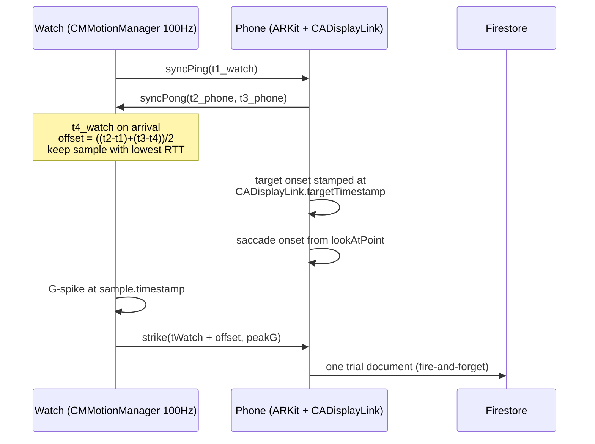

> **OUT OF DATE — archived.** Do not use for product or agent guidance.
> Canonical source of truth: [`docs/MASTER.md`](../MASTER.md)
> Archived: 2026-07-25


---
name: Synapse hackathon build
overview: "A 48-hour build plan for Synapse: an iPhone ARKit reaction-task app, an Apple Watch Series 5 strike detector synchronized via a Cristian's-algorithm clock handshake, Firestore as the shared store, and a React/Three.js clinical dashboard — organized so a working demo exists from hour 20 onward."
todos:
  - id: p1-scaffold
    content: "Phase 1: Verify watch's watchOS version and set deployment target (10.0 preferred, 9.0 fallback). Set signing team. Create project.yml with iOS + watchOS targets and correct bundle IDs (com.synapse.app / com.synapse.app.watchkitapp), run xcodegen generate, confirm both targets build and install on physical devices."
    status: completed
  - id: p1-physical-test
    content: "Phase 1: Physical range test before any engine code. Mount iPhone on tripod at 60-70cm, confirm ARFaceAnchor tracking survives someone throwing jabs that stop short, and that tripod vibration doesn't break tracking. Adjust ergonomics now if it fails."
    status: completed
  - id: p1-clocksync
    content: "Phase 1: Implement Cristian's-algorithm clock handshake over WatchConnectivity. Watch sends syncPing(t1), phone replies (t2,t3), watch stamps t4, offset = ((t2-t1)+(t3-t4))/2. Burst 20 samples, keep lowest-RTT one, re-sync every 30s. Add ClockDomain.swift with distinct PhoneTime/WatchTime types so raw Doubles can never be mixed."
    status: completed
  - id: p1-watch-motion
    content: "Phase 1: Watch app with HKWorkoutSession keep-alive and CMMotionManager at 100Hz. Detect G-spike above threshold, capture the accelerometer sample's own timestamp (not handler run time), convert to phone clock, send via sendMessage with peak-G. Keep watch UI to a single status label plus haptics."
    status: completed
  - id: p1-firebase
    content: "Phase 1: Create Firebase project, enable Firestore with open demo rules (add an expiry date comment), add GoogleService-Info.plist to iOS target only, add Firebase SPM dependency. Freeze the schema and scaffold a Vite + React + Tailwind app that reads a session live."
    status: completed
  - id: p2-facetracker
    content: "Phase 2: ARKit face session using ARFaceAnchor.lookAtPoint for gaze. Implement SaccadeDetector with velocity threshold + hysteresis and sub-frame linear interpolation of the crossing point for onset timing. Compute blink-gated arousal index from eyeWide blendshapes, discarding a 100ms window around each blink."
    status: completed
  - id: p2-displayclock
    content: "Phase 2: DisplayClock using CADisplayLink.targetTimestamp to stamp true target-presentation time, not the SwiftUI state mutation."
    status: completed
  - id: p2-trialengine
    content: "Phase 2: TrialEngine state machine driving the 3x3 target grid, correlating target onset, saccade onset, and strike into a trial record. Compute visualRtMs, motorRtMs, and the hero cognitiveMotorGapMs. Mark trials invalid on blink contamination or missed strike."
    status: completed
  - id: p2-writer
    content: "Phase 2: SessionWriter with buffered fire-and-forget Firestore writes (never await inside the game loop). One document per trial plus a single packed gaze-window doc covering -200ms to +800ms around each target."
    status: completed
  - id: p3-dashboard
    content: "Phase 3: React dashboard with live Firestore subscription, metric tiles, and timeline charts of visual RT vs motor RT vs Cognitive-Motor Gap. Display clock sync quality (offset and RTT) as a credibility indicator."
    status: completed
  - id: p3-threejs
    content: "Phase 3: Three.js gaze field visualization rendering the 3x3 target grid in 3D with gaze vectors and drift heatmap per trial, scrubbable along the session timeline."
    status: completed
  - id: p3-breakpoint
    content: "Phase 3: Fatigue break-point detector. Rolling baseline mean and stddev over the first 10 trials; when a trial's gap exceeds baseline by 2 sigma, simultaneously fire a distinctive watch haptic, a full-bleed red dashboard banner naming the trial number, and an audio cue. Persist breakPointTrial to the session doc."
    status: completed
  - id: p4-offline
    content: "Phase 4: Airplane-mode resilience test. Verify Firestore local persistence queues writes through a 2+ second outage and flushes cleanly, and that the trial loop never stalls waiting on network."
    status: completed
  - id: p4-fallback
    content: "Phase 4: Build canned-session replay mode that pushes a recorded session through the live pipeline as a one-tap fallback. Record a backup demo video. Configure personal hotspot instead of venue Wi-Fi."
    status: completed
  - id: p4-rehearse
    content: "Phase 4: Set up AirPlay mirroring of the phone into a corner of the projection, add the dashboard QR code to the title slide, charge the Series 5 to 100% with charger on the demo table, and rehearse the 3-minute pitch five times against a clock."
    status: completed
isProject: false
---

# Synapse: 48-Hour Execution Plan

## Locked Decisions

- **Hardware:** iPhone with Face ID (mounted on a tripod) plus Apple Watch **Series 5**. No iPad.
- **Watch networking:** WatchConnectivity `sendMessage` carrying watch-local timestamps, converted to phone-clock via an offset handshake. The phone is the **only** Firebase writer.
- **Task UI:** Fixed 3x3 Batak-style grid on the mounted iPhone.
- **Storage:** Firestore, `sessions/{id}` with a `trials` subcollection.
- **Demo:** Live athlete punching on stage, dashboard projected behind them.

## Hero Metric

**Cognitive-Motor Gap** = `strikeMs - saccadeOnsetMs`. The interval between the brain acquiring the target and the body executing. No single-device app can produce this number, which is what makes the two-device architecture defensible under questioning.

## Series 5 Constraints

- Series 5 caps at **watchOS 10.6**. Set `WATCHOS_DEPLOYMENT_TARGET = 10.0` and use `@Observable`. If the watch turns out to be on watchOS 9.x, either update it in hour 0 or drop to target 9.0 and use `ObservableObject` instead — decide this in the first 15 minutes, not later.
- `CMBatchedSensorManager` (800Hz) requires Series 8+. Use `CMMotionManager` at 100Hz, which gives 10ms strike resolution. Adequate.
- The S5 chip is slow. The watch UI is one status label plus haptics. No charts, no animation, no SwiftUI complexity.
- An aging S5 battery under a continuous `HKWorkoutSession` drains fast. Charge to 100% before the pitch and keep the charger on the demo table.

## The Two Real Risks

### Risk 1: Three unrelated clocks

`CMLogItem.timestamp` is seconds since the *watch's* boot. `CACurrentMediaTime()` is seconds since the *phone's* boot. Subtracting them is meaningless. Stamping the strike on message *arrival* is also wrong — Bluetooth latency is 20–80ms and spikes past 150ms in a crowded venue, which is the same magnitude as the fatigue signal itself.

The fix decouples accuracy from delivery. The watch detects the punch locally, stamps it with the accelerometer sample's own timestamp, converts to phone-clock using a measured offset, and sends it. A packet arriving 300ms late still yields an exact reaction time.



Run twenty handshake round-trips in a burst and keep only the **lowest-RTT** sample — low RTT implies low path asymmetry, which is what corrupts the offset estimate. Re-sync every 30 seconds for crystal drift.

Two adjacent traps: target onset must be stamped from `CADisplayLink.targetTimestamp` (the presentation time, same `CACurrentMediaTime()` domain), not from the SwiftUI state mutation, which precedes actual scan-out by one to two frames. And the watch app suspends the moment the wrist drops unless it holds an `HKWorkoutSession` — this kills more watch demos than anything else.

### Risk 2: ARKit at 60Hz cannot measure saccadic velocity

Saccades last 30–80ms, so at 16.7ms per frame they span two to five samples — below Nyquist. `leftEyeTransform` is also a fitted-model output with a couple degrees of noise and built-in smoothing, not pupil tracking.

Change the claim, not the math. **Saccade onset latency is measurable at 60Hz and is the more meaningful metric.** Detect the velocity threshold crossing with hysteresis, then linearly interpolate between the two bracketing samples for sub-frame precision. Report onset latency and settle time as primary; if you show a velocity trace, label it a relative smoothed index, never degrees per second.

Use `ARFaceAnchor.lookAtPoint` rather than composing the two eye transforms — more stable, and it saves an hour of quaternion debugging. Gate the `eyeWide` arousal proxy on `eyeBlinkLeft`/`eyeBlinkRight`, discarding a ~100ms window around each blink, since blinks produce huge transients in that signal.

### Physical constraint to test in hour 1

TrueDepth face tracking degrades past roughly 70cm, but a jab extends 60–70cm from the shoulder. These barely coexist. **Before writing the trial engine, mount the phone at 60–70cm and confirm the face anchor holds while someone throws jabs that stop short of the screen.** If tracking drops out, the ergonomics change (athlete stands closer and punches past the phone rather than at it), and that is a Phase 1 decision, not an hour-40 discovery. Also verify that tripod vibration from near-misses doesn't break tracking.

## Firestore Schema

Freeze this in hour 4 and hand it to the dashboard work so both sides build in parallel.

```
sessions/{sessionId}
  athleteId, startedAt, status: "active"|"complete"
  clockOffsetMs, clockRttMs          // sync quality, shown on dashboard
  baselineGapMs, baselineStdMs       // computed after trial 10
  breakPointTrial: Int?              // set when fatigue onset fires

sessions/{sessionId}/trials/{index}
  index, targetCell                  // 0..8
  targetOnsetMs                      // phone clock, CADisplayLink
  saccadeOnsetMs, gazeSettleMs
  strikeMs                           // watch clock + offset
  visualRtMs                         // saccadeOnset - targetOnset
  motorRtMs                          // strike - targetOnset
  cognitiveMotorGapMs                // HERO: strike - saccadeOnset
  peakG, arousalIndex, valid

sessions/{sessionId}/trials/{index}/gaze  // window only: -200ms..+800ms
  t0Ms, samples: [{dt, x, y, z}]           // ~60 packed samples, one doc
```

Write gaze only as a per-trial window, not a continuous 60Hz stream. It is all the Three.js view needs and it cuts write volume by an order of magnitude.

## Project Layout

```
project.yml                  # XcodeGen; never hand-edit .pbxproj
Sources/Shared/              # in both targets
  ClockDomain.swift          # PhoneTime/WatchTime types, no raw Doubles
  StrikeEvent.swift          # Codable WC payload
Sources/iOS/
  Session/TrialEngine.swift  # state machine
  Session/DisplayClock.swift # CADisplayLink onset stamping
  Face/FaceTracker.swift     # ARSessionDelegate
  Face/SaccadeDetector.swift # hysteresis + sub-frame interpolation
  Connectivity/PhoneSessionManager.swift
  Firebase/SessionWriter.swift  # buffered, fire-and-forget
  UI/TargetGridView.swift, HUDView.swift
Sources/watchOS/
  MotionMonitor.swift        # 100Hz, threshold + peak-G
  WorkoutKeepAlive.swift     # HKWorkoutSession
  ClockSyncClient.swift      # Cristian's algorithm
web/                         # Vite + React + Tailwind + Three.js
```

Bundle IDs: `com.synapse.app` and `com.synapse.app.watchkitapp` — the watch ID **must** be the phone ID plus `.watchkitapp`. Set the signing team once in Xcode before anything else. `GoogleService-Info.plist` goes in the iOS target only; the watch never touches Firebase.

## Timeline

**Phase 1 — De-risk the clock (H0–8).** Signing, XcodeGen scaffold, watchOS version check, Firebase project, physical range test. Then the only thing that matters: the offset handshake, `HKWorkoutSession` keep-alive, 100Hz threshold detection.
*Exit: punch the air, see a correctly phone-clocked event, with measured RTT under 100ms.*

**Phase 2 — The trial loop (H8–20).** ARKit face session, saccade onset detection, `CADisplayLink` stamping, trial state machine, Firestore writes.
*Exit: a full trial writes a Cognitive-Motor Gap to Firestore.* **This is the minimum viable demo. Everything after is upside.**

**Sleep H20–26.** Six hours, non-negotiable. The pitch is the deliverable and a tired presenter loses to a rested one.

**Phase 3 — Make it beautiful (H26–38).** React dashboard with live subscription, Three.js gaze field, timeline charts, and the break-point detector: rolling baseline over the first ten trials, and when a gap exceeds baseline by 2σ, fire a distinctive watch haptic, a full-bleed red dashboard banner, and an audio cue simultaneously.

**Phase 4 — Harden and rehearse (H38–46).** Airplane-mode test (never `await` a Firebase write inside the game loop — fire and forget and let local persistence absorb the outage), canned replay mode as a hard fallback, backup video, personal hotspot instead of venue Wi-Fi, AirPlay mirroring so the audience sees the grid. Rehearse the three minutes five times against a clock.

**H46–48: code freeze.** Pitch only. Any code written here is a bug.

## Pitch Notes

The iPhone screen is the *instrument*, not the audience view — the projected dashboard is what the room watches. Mirror the phone via AirPlay in a corner of the projection so people can see targets light up.

Put a QR code to the live dashboard on the title slide. Judges pull it up on their own phones and watch data stream in while you're still talking, which converts them from spectators to users and proves the backend is genuinely live rather than a canned animation.

The money line, once the break-point banner fires: *the system detected the crash four trials before the athlete could feel it.*